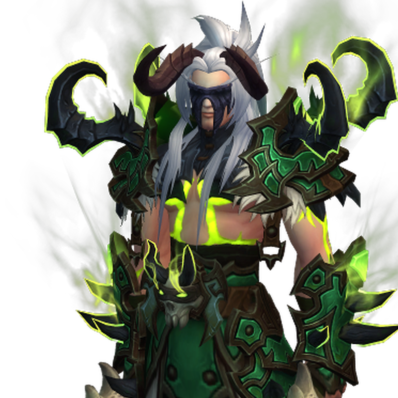
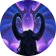
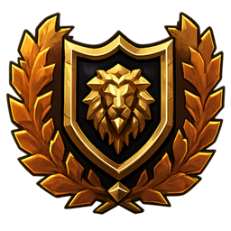

---
hide:
  - navigation
  - toc
---

  <section class="ww-home__hero">
    

      World of Warcraft × Discord
      <h1>Bring your character to your Discord profile.</h1>
      
WoWidget displays your character portrait, progression, and selected statistics in a polished Discord Profile Widget.

      

        <a class="ww-home__button ww-home__button--primary" href="getting-started/installation/">Get started</a>
        <a class="ww-home__button ww-home__button--secondary" href="https://github.com/solxvt/WoWidget" target="_blank" rel="noopener">View on GitHub</a>
      

    

    

      

      

        <section class="ww-discord-widget__hero">
          

            
            WoWidget
          

          

            <h2>Solcide</h2>
            

              Blood Elf Demon Hunter
              
            

            
Realm: Area 52

            
Guild: N/A

          

          
        </section>

        <section class="ww-discord-widget__stats" aria-label="Character statistics">
          

            <strong class="ww-discord-widget__stat-value">
              Devourer
              
            </strong>
            Current Spec
          

          

            <strong>293</strong>
            Item Lvl
          

          

            <strong class="ww-discord-widget__stat-value">
              8.24K
              
            </strong>
            Achievements
          

          

            <strong>3.4K</strong>
            Mythic+
          

          

            <strong>2105</strong>
            PvP
          

          

            <strong>9/10 M</strong>
            Progression
          

        </section>
      

      
Example of a fully configured WoWidget on a Discord profile.

    

  </section>

  <section class="ww-home__links" aria-labelledby="ww-home-links-title">
    

      Explore WoWidget
      <h2 id="ww-home-links-title">Where would you like to go?</h2>
    

    

      <a class="ww-home__link-card" href="getting-started/installation/">
        01
        
          <strong>Getting Started</strong>
          <small>Install WoWidget and connect your accounts.</small>
        
        →
      </a>

      <a class="ww-home__link-card" href="reference/faq/">
        02
        
          <strong>Frequently Asked Questions</strong>
          <small>Learn how WoWidget works and what to expect.</small>
        
        →
      </a>

      <a class="ww-home__link-card" href="support/troubleshooting/">
        03
        
          <strong>Troubleshooting</strong>
          <small>Find solutions to common setup problems.</small>
        
        →
      </a>

      <a class="ww-home__link-card" href="reference/widget-variables/">
        04
        
          <strong>Widget Variables</strong>
          <small>Browse supported statistics and data fields.</small>
        
        →
      </a>

      <a class="ww-home__link-card" href="https://github.com/solxvt/WoWidget" target="_blank" rel="noopener">
        05
        
          <strong>GitHub</strong>
          <small>View the source code, releases, and project updates.</small>
        
        ↗
      </a>

      <a class="ww-home__link-card" href="https://github.com/solxvt/WoWidget/issues" target="_blank" rel="noopener">
        06
        
          <strong>Report an Issue</strong>
          <small>Submit a bug report or request a feature.</small>
        
        ↗
      </a>
    

  </section>

  <footer class="ww-home__footer">
    WoWidget is free and open source.
    <a href="https://github.com/solxvt/WoWidget" target="_blank" rel="noopener">GitHub</a>
  </footer>

